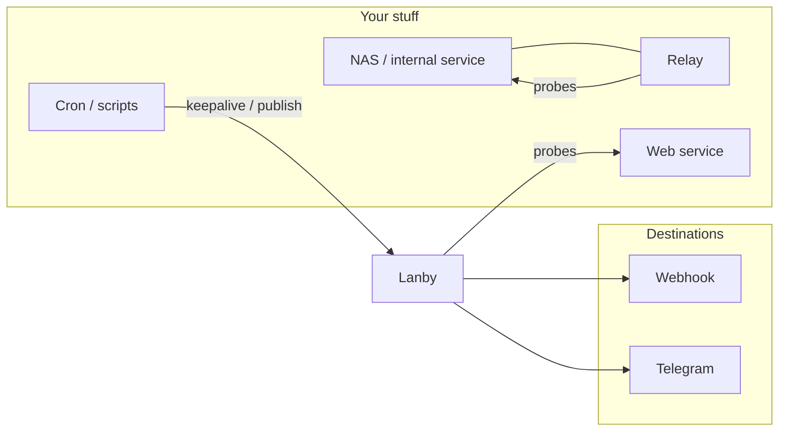

# Lanby Docs

Lanby watches your services from the outside and pings you when something's wrong. It runs on infrastructure that's completely separate from what you're monitoring, so an outage can't take the watchman down with it.

These docs cover the two jobs Lanby does:

1. **Uptime monitoring** — probes that actively check services (HTTP, TCP, DNS, ping, gRPC) on a schedule, and keepalive heartbeats where your jobs check in with Lanby after each run.
2. **Notification delivery** — a simple publish API and a set of destinations (webhooks, Telegram, more on the way) that route events to the people and systems that should know.

---

## How the pieces fit

- **Probes** hit public services directly from Lanby's cloud.
- **Relays** extend probes into private networks — no inbound firewall changes, outbound HTTPS only.
- **Keepalive heartbeats** and the **Publish API** flip the direction: your jobs call Lanby.
- **Destinations** receive every event — monitor alerts and published notifications alike — routed by topic.

---

## Start here

New to Lanby? These pages in order cover 80% of what you'll actually configure:

1. [**Monitor types**](monitors.md) — pick the right probe or keepalive for what you're watching.
2. [**Destinations**](destinations.md) — set up where alerts go.
3. [**Relay agents**](relays.md) — deploy one if you want to monitor private network services.
4. [**Keepalive heartbeats**](keepalive.md) — wire up cron jobs, backups, and scheduled tasks.
5. [**Publish API**](notifications.md) — send arbitrary events from any script to your existing destinations.

---

## All documentation

### Concepts

[**Relay agents**](relays.md)
: How relays work, the security model, deployment, and claiming — for monitoring private network services without opening inbound firewall ports.

### Monitoring

[**Monitor types**](monitors.md)
: Every monitor type — active probes (HTTP, TCP, ping, DNS, gRPC) and keepalive heartbeats — including what's live and what's on the roadmap.

[**Keepalive heartbeats**](keepalive.md)
: Monitor cron jobs, backup scripts, and scheduled tasks by having them check in with Lanby after each successful run.

### Alerts & Delivery

[**Destinations**](destinations.md)
: Configure where Lanby sends alerts — webhooks, Telegram, topic routing, and the dead-letter queue.

[**Publish API**](notifications.md)
: Publish events to Lanby from any script, app, or cron job with a single HTTP call.
