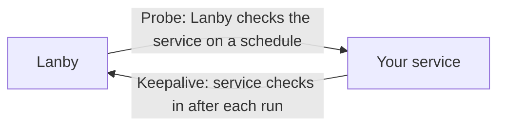

# Monitor types

Lanby supports two broad categories of monitoring: **probes** that actively test a service on a schedule, and **keepalive heartbeats** that expect your service to check in periodically.



Probes fit anything that's always-on and reachable — web apps, databases, game servers, routers. Keepalives fit anything that runs on a schedule — cron jobs, backups, data pipelines.

## Monitor states

Every monitor is always in one of these states:

| State | Meaning |
|---|---|
| `pending` | Newly created, no results yet. No alerts fire. |
| `up` | Last check passed. |
| `degraded` | Check passed but response was slow (above `slow_threshold_ms`), or a TLS certificate is expiring soon. |
| `down` | Check failed — wrong status, timeout, connection refused, etc. |
| `paused` | Monitoring suspended. No checks run, no alerts fire. |
| `unknown` | Monitor exists but no recent data. Occurs after a long offline period. |

**Degraded vs down:** `degraded` means the service is reachable but something is worth flagging — high latency, an expiring certificate, or an unexpected but non-fatal response. `down` means the service failed the check outright. Both states trigger alerts; you can configure separate alert channels for each.

## Retries and recovery

**Retries:** Before marking a monitor down, Lanby retries the failing probe up to the configured retry count. This prevents transient blips from firing spurious alerts. A probe must fail `retries + 1` consecutive times to transition to `down`.

**Recovery:** By default, a single passing check recovers a monitor from `down` back to `up`. Set `recovery_successes` to require multiple consecutive passes before recovery — useful for flappy services.

**Recovery interval:** When a monitor is `down` or `degraded`, the relay switches to `recovery_interval_seconds` instead of the normal interval. Set this lower than the normal interval to detect recovery faster.

---

## Probe monitors

Probe monitors run on a configured schedule and actively test a target. If the target fails — wrong status code, unreachable port, timeout — Lanby marks it as down and fires an alert.

Probes run from the Lanby platform (for publicly reachable services) or from a [relay agent](relays.md) for private network services.

---

### HTTP / HTTPS

Sends an HTTP request to a URL and validates the response. The most common probe type.

#### Configuration

| Field | Default | Description |
|---|---|---|
| `target` | required | Full URL including scheme. e.g. `https://mynas.local:8080/health` |
| `method` | `GET` | HTTP method: `GET`, `HEAD`, or `POST` |
| `interval_seconds` | `60` | How often to run the probe |
| `timeout_seconds` | `10` | Request timeout. Probe fails if no response within this time. |
| `retries` | `0` | Number of additional attempts before marking down |
| `recovery_successes` | `1` | Consecutive passes needed to recover from down |
| `recovery_interval_seconds` | *(same as interval)* | Interval to use while the monitor is down/degraded |
| `slow_threshold_ms` | *(disabled)* | Mark as `degraded` if response takes longer than this |
| `expected_status` | *(any 2xx)* | Exact HTTP status code required for success |
| `success_http_status_codes` | *(empty)* | List of acceptable HTTP status codes. Overrides `expected_status` if set. |
| `http_body_contains` | *(disabled)* | Response body must contain this substring |
| `follow_redirects` | `true` | Whether to follow HTTP redirects |
| `max_redirects` | `5` | Maximum redirects to follow |
| `headers` | *(empty)* | Map of HTTP headers to include in the request |
| `ignore_tls_errors` | `false` | Skip TLS certificate verification. Use only for internal services with self-signed certs. |
| `check_cert_expiry` | `false` | Alert when the TLS certificate is close to expiry |
| `cert_expiry_min_days` | `14` | Days before expiry to start alerting (requires `check_cert_expiry: true`) |

#### Examples

**Basic health check:**
```
Target: https://myapp.local/health
Method: GET
Expected status: 200
Interval: 60s
Timeout: 10s
```

**Authenticated API endpoint:**
```
Target: https://myapp.local/api/status
Method: GET
Headers:
  Authorization: Bearer mysecrettoken
  X-Internal: true
Expected status: 200
```

**Body keyword match — check the app is actually up, not just returning 200 from a load balancer:**
```
Target: https://myapp.local/
Body contains: "status":"healthy"
```

**Self-signed certificate (common for internal services):**
```
Target: https://192.168.1.50:8443/
Ignore TLS errors: true
```

**Certificate expiry monitoring:**
```
Target: https://myapp.example.com/
Check cert expiry: true
Cert expiry min days: 21
```
This marks the monitor as `degraded` 21 days before the cert expires, giving you time to renew before it goes `down`.

**Slow response alerting:**
```
Target: https://myapp.local/
Slow threshold: 2000ms
```
Responses over 2 seconds mark the monitor `degraded` even if the status code is correct.

**Specific status codes — useful for endpoints that return 204 or 401:**
```
Target: https://myapp.local/api/metrics
Success status codes: [200, 204]
```

---

### TCP port

Attempts to open a TCP connection to a host and port. Succeeds if the connection is accepted; fails if refused or timed out. No application-layer handshake — pure connectivity.

#### Configuration

| Field | Default | Description |
|---|---|---|
| `target` | required | `host:port` — e.g. `192.168.1.10:5432` or `mynas.local:22` |
| `interval_seconds` | `60` | How often to probe |
| `timeout_seconds` | `10` | Connection timeout |
| `retries` | `0` | Retries before marking down |
| `recovery_successes` | `1` | Passes needed to recover |
| `recovery_interval_seconds` | *(same as interval)* | Faster interval while down |

#### Examples

```
# PostgreSQL on a private server
Target: 192.168.1.10:5432

# SSH availability
Target: mynas.local:22

# Minecraft server
Target: mc.home.arpa:25565

# Home Assistant
Target: homeassistant.local:8123
```

---

### ICMP ping

Sends ICMP echo requests. The simplest reachability check — useful when no port is guaranteed to be open.

!!! warning
    ICMP ping **requires a relay**. The Lanby platform runs in cloud environments that block raw ICMP. Additionally, the relay container needs `NET_RAW` capability — see [relay docs](relays.md#icmp-ping-and-docker-capabilities).

#### Configuration

| Field | Default | Description |
|---|---|---|
| `target` | required | Hostname or IP address. e.g. `192.168.1.1` or `router.local` |
| `timeout_seconds` | `10` | Wait time for ICMP reply |
| `interval_seconds` | `60` | How often to ping |
| `retries` | `0` | Retries before marking down |

#### Examples

```
# Router/gateway reachability
Target: 192.168.1.1

# Network device with no open ports
Target: 192.168.1.200

# Another machine by hostname
Target: myserver.local
```

---

### DNS

Resolves a DNS name and optionally validates the answer. Useful for detecting broken records, split-horizon mismatches, or unexpected changes.

#### Configuration

| Field | Default | Description |
|---|---|---|
| `target` | required | Used as `dns_host` if `dns_host` is not set |
| `dns_host` | *(target value)* | The hostname to resolve |
| `dns_type` | `A` | Record type: `A`, `AAAA`, `CNAME`, `TXT`, `NS` |
| `dns_expect` | *(disabled)* | Substring that must appear in at least one answer record |
| `dns_nameserver` | *(system resolver)* | Query a specific nameserver instead. e.g. `192.168.1.1` or `8.8.8.8` |
| `interval_seconds` | `60` | How often to query |
| `timeout_seconds` | `5` | Query timeout |

#### Examples

**Check a domain resolves at all:**
```
DNS host: myapp.local
Type: A
```

**Verify a specific IP is returned (e.g. your internal DNS overrides an external record):**
```
DNS host: myapp.example.com
Type: A
Expect: 192.168.1.50
```
Fails if the answer doesn't contain `192.168.1.50` — useful to catch split-horizon DNS breaking.

**Check your Pi-hole or AdGuard Home is resolving correctly:**
```
DNS host: google.com
Type: A
Nameserver: 192.168.1.53
```
Queries your local resolver directly, bypassing the system default.

**Monitor a Let's Encrypt TXT record or DKIM selector:**
```
DNS host: _dmarc.example.com
Type: TXT
Expect: v=DMARC1
```

**Check CNAME is pointing at the right place:**
```
DNS host: www.example.com
Type: CNAME
Expect: example.com
```

---

### gRPC health

Calls the standard `grpc.health.v1.Health/Check` RPC and expects a `SERVING` response. Compatible with any service implementing the [gRPC Health Checking Protocol](https://github.com/grpc/grpc/blob/master/doc/health-checking.md).

#### Configuration

| Field | Default | Description |
|---|---|---|
| `target` | required | `host:port` — e.g. `myservice.local:50051` |
| `grpc_service` | *(empty — checks overall server health)* | Sub-service name to check |
| `grpc_tls` | `false` | Use TLS. Set to `true` for production gRPC services. |
| `interval_seconds` | `60` | How often to check |
| `timeout_seconds` | `10` | RPC timeout |
| `retries` | `0` | Retries before marking down |

#### Examples

**Overall server health:**
```
Target: myservice.local:50051
TLS: false
```

**Specific sub-service (e.g. a gRPC service with multiple handlers):**
```
Target: myservice.local:50051
Service: myapp.v1.UserService
TLS: true
```

---

## Keepalive monitors

Keepalive monitors flip the relationship: your service checks in with Lanby after each run. If check-ins stop arriving, Lanby alerts you.

[Full keepalive documentation →](keepalive.md)

---

## Planned probe types

### Browser / synthetic

Drives a real browser to load a page and optionally interact with it — clicking buttons, filling forms, asserting text. Catches JavaScript errors, broken logins, and issues that HTTP probes miss entirely.

*Requires a relay. Powered by Playwright.*

### SMTP / mail server

Connects to an SMTP server and performs the initial handshake (EHLO). Confirms the mail server is listening and responding — useful for self-hosted mail setups like Mailcow, Maddy, or Postfix.

*Ports 25, 465, 587. STARTTLS support planned.*

### UDP

Sends a UDP packet and optionally checks for a response. Useful for game servers, VPN endpoints (WireGuard, OpenVPN), and other connectionless services.

*Requires a relay.*

### SNMP

Polls an SNMP OID and checks the returned value against a threshold or expected string. Monitor network switches, routers, NAS devices, and UPSes that speak SNMP but don't expose an HTTP API.

*SNMPv1, v2c, v3. Requires a relay.*

### Push / webhook receiver

Receives an inbound webhook payload from an external service (Grafana alerts, GitHub Actions, Uptime Kuma) and converts it into a Lanby notification.

!!! info
    Have a monitor type you need that isn't listed? Reach out — we build based on what self-hosters actually run.

