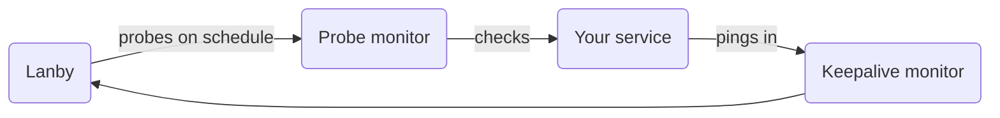

# Monitor types

Lanby supports two broad categories of monitoring: **probes** that actively test a service on a schedule, and **keepalive heartbeats** that expect your service to check in periodically.

Probes are outbound — Lanby tests your service. Keepalives are inbound — your service tells Lanby it's alive.

## Probe monitors

Probe monitors run on a configured interval and actively test a target. If the target fails to respond as expected — wrong status code, unreachable port, timeout — Lanby marks the monitor as degraded or down and fires an alert.

Probes can run from the Lanby platform (for publicly reachable services) or be assigned to a [relay agent](relays.md) for services inside a private network.

### HTTP / HTTPS `live`

Sends an HTTP request (GET, HEAD, or POST) to a URL and validates the response. The most common probe type — covers the vast majority of web services, APIs, and dashboards.

- Pass/fail on HTTP status code — any 2xx by default, or a specific list
- Optional body keyword match — response must contain a given substring
- TLS certificate expiry checking — alert before the cert expires
- Custom request headers — for authenticated endpoints
- Configurable redirect behaviour — follow or treat redirects as failures
- Timeout, interval, and retry control

*Available from the platform and relay-assignable.*

---

### TCP port `live`

Attempts to open a TCP connection to a host and port. Succeeds if the connection is accepted; fails if the port is closed, filtered, or times out. Works for any TCP service regardless of application protocol.

- Any host and port combination
- No application-layer handshake — pure connectivity check
- Ideal for databases, game servers, custom daemons, IoT devices

*Available from the platform and relay-assignable. Relay recommended for private hosts.*

---

### ICMP ping `live`

Sends ICMP echo requests to a host. The simplest possible reachability check — useful for confirming a machine is online when no port is guaranteed to be open.

!!! warning
    Raw ICMP is not available from the Lanby platform — most cloud environments block it. ICMP ping monitors **require a relay** running inside a network that can reach the target.

---

### DNS `live`

Resolves a DNS name and optionally checks the answer against an expected substring. Useful for detecting misconfigured records, propagation issues, or unexpected changes to authoritative answers.

- Supports A, AAAA, CNAME, TXT, NS record types
- Optional expected-answer substring match
- Custom nameserver — query a specific resolver instead of the system default

*Available from the platform and relay-assignable.*

---

### gRPC health `live`

Calls the standard `grpc.health.v1.Health/Check` RPC and expects a `SERVING` response. Compatible with any service that implements the [gRPC Health Checking Protocol](https://github.com/grpc/grpc/blob/master/doc/health-checking.md) — the same standard used by Kubernetes gRPC liveness probes.

- Optional service name — check a specific sub-service
- TLS support including plaintext (insecure) mode

*Available from the platform and relay-assignable.*

---

## Keepalive monitors

Keepalive monitors flip the relationship: instead of Lanby probing your service, *your service checks in with Lanby*. If a check-in doesn't arrive within the expected window, Lanby marks the monitor as down and fires an alert.

This is ideal for anything that runs on a schedule — cron jobs, backup scripts, data pipelines, batch processors — where you can't meaningfully probe from the outside, but you can add a single HTTP call at the end of a successful run.

### HTTPS heartbeat `live`

Lanby generates a unique endpoint URL for each keepalive monitor. Your service sends a `POST` to that URL to register a check-in. If a check-in doesn't arrive within the configured interval plus a grace period, the monitor goes down.

- Unique per-monitor heartbeat URL — no credentials needed beyond an API key
- Configurable interval and grace period
- Works from any language or environment that can make an HTTP request
- Code snippets available in the console: curl, bash, cron, Python

[Full setup guide and examples →](keepalive.md)

---

## Planned probe types

These are on the roadmap and not yet available in the console.

### Browser / synthetic `planned`

Drives a real browser to load a page and optionally interact with it — clicking buttons, filling forms, asserting text. Catches JavaScript errors, broken logins, and issues that HTTP probes miss entirely.

*Requires a relay. Powered by Playwright.*

### SMTP / mail server `planned`

Connects to an SMTP server and performs the initial handshake (EHLO). Confirms the mail server is listening and responding — useful for self-hosted mail setups like Mailcow, Maddy, or Postfix.

*Ports 25, 465, 587. STARTTLS support.*

### UDP `planned`

Sends a UDP packet and optionally checks for a response. Useful for game servers, VPN endpoints (WireGuard, OpenVPN), DNS over UDP, and other connectionless services.

*Requires a relay.*

### Push / webhook receiver `planned`

Receives an inbound webhook payload from an external service (Grafana alerts, GitHub Actions, Uptime Kuma, etc.) and converts it into a Lanby notification. Route third-party events through the same destinations you already have configured.

### SNMP `planned`

Polls an SNMP OID and checks the returned value against a threshold or expected string. Monitor network switches, routers, NAS devices, and UPSes that speak SNMP but don't expose an HTTP API.

*SNMPv1, v2c, v3. Requires a relay.*

!!! info
    Have a monitor type you need that isn't listed? Lanby is in early beta — we're building based on what self-hosters actually run. Reach out and let us know.

---

## About the name

A **LANBY** — *Large Automatic Navigation BuoY* — is a floating navigational aid designed to replace crewed lightships. A LANBY sits offshore, watching over shipping lanes, broadcasting its signal continuously. It's monitored from onshore and built to run for extended periods without human intervention.

That's exactly what Lanby the product is: infrastructure that watches your services quietly, reliably, from the outside — so you don't have to.
