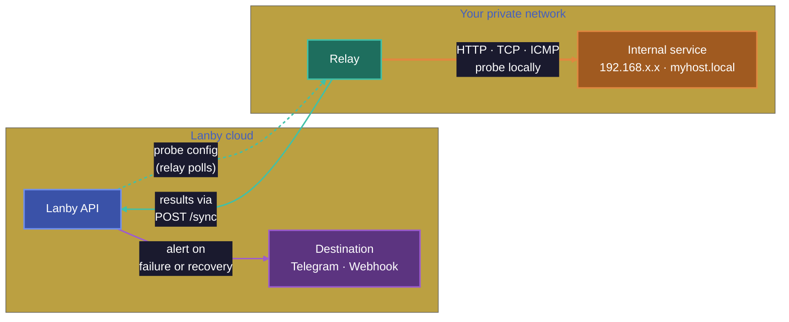
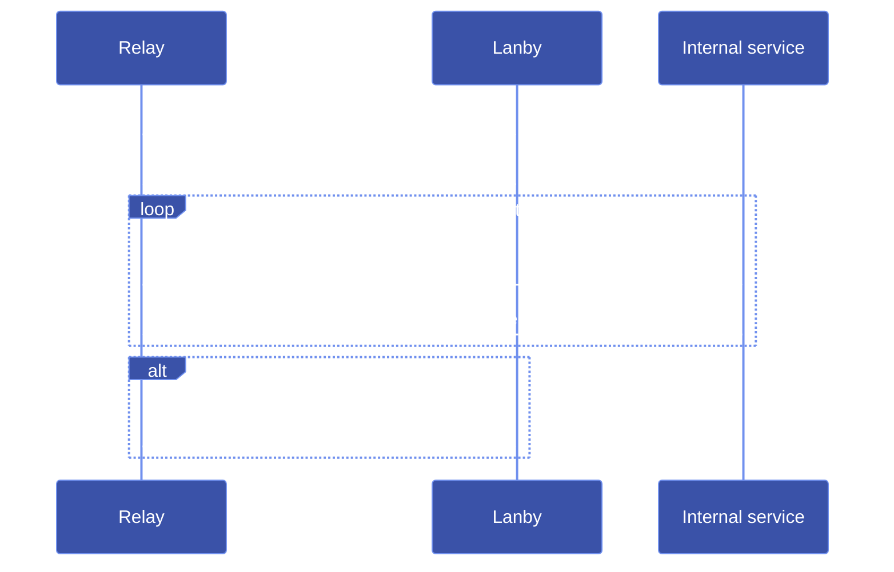

# Relay

A Relay is a lightweight agent you run inside your own network. It polls Lanby for assigned monitors and executes probes locally — letting you monitor services that are never exposed to the internet, without opening any inbound firewall ports.



!!! tip "Ready to set one up?"
    [**Get your Relay running →**](#get-your-relay-running)

---

## Why Relay exists

Lanby's platform-managed probes run from the internet. That works great for public services, but breaks down the moment you want to check anything on a private network — a NAS, a home automation server, an internal database, or a service behind a VPN.

The naive solution — punch a hole in your firewall and let Lanby reach in — trades monitoring convenience for a permanent inbound exposure. A Relay takes the opposite approach: the agent reaches *out* to Lanby. Your firewall stays exactly as it is.

## How it works

The Relay polls Lanby on a regular interval, receives its current probe configuration, executes due probes locally, and ships results back — all over a single outbound HTTPS connection.



**Adaptive polling:** The Relay dynamically adjusts its sync interval to match the shortest probe interval in its assigned set. When a probe fails, results are flushed immediately rather than waiting for the next tick, so alerts fire as fast as possible.

**Connectivity loss:** If the Relay loses connectivity to Lanby, probe results are buffered in memory (up to 500 results) and flushed on the next successful sync. Probes continue running locally during an outage. Results are not persisted to disk — if the Relay process restarts during an outage, buffered results are lost, but the probe history resumes from the next successful sync.

## What data leaves your network

This is the complete list of what the Relay sends to Lanby. Nothing else crosses the network boundary.

**Sent on every sync:**

| Field | Example | Notes |
|---|---|---|
| Relay version | `0.3.1` | The Relay binary's version string |
| Config ETag | `"abc123"` | Used for conditional config fetch — avoids re-sending unchanged config |

**Sent with probe results:**

| Field | Example | Notes |
|---|---|---|
| Monitor ID | `mon_01j...` | Opaque ID assigned by Lanby |
| Timestamp | `2025-11-14T03:21:05Z` | When the probe ran |
| Status | `ok`, `fail`, `error` | Outcome of the probe |
| Duration | `142` (ms) | How long the probe took |
| HTTP status code | `200` | For HTTP probes only |
| Error message | `connection refused` | Only present on failure |

**Sent on registration/claim:**

| Field | Notes |
|---|---|
| Hostname | `os.Hostname()` output — the machine name, not an IP |
| OS | `linux`, `darwin`, etc. |
| Architecture | `amd64`, `arm64`, etc. |

**Never sent:**

- Response bodies from probed services
- Request contents or credentials used in probes
- Internal IP addresses or network topology
- Any data from services beyond pass/fail outcomes
- DNS answers, TLS certificate contents, or any payload data

## Security model

**No inbound ports, ever.**
The Relay does not listen on any port. There is nothing reachable from outside your network — not from Lanby, not from anyone else. Your firewall rules do not change.

**Outbound HTTPS only.**
All communication is initiated by the Relay over port 443 to `api.lanby.dev`. No other outbound connections are made. The Relay does not phone home for updates, telemetry, or anything else.

**Probe results only, never payload data.**
The Relay sends *outcomes* back to Lanby: pass/fail, latency, HTTP status code, and error message text. Response bodies stay inside your network.

**No special privileges required.**
The Relay container runs as an unprivileged process. No `--privileged` flag, no host networking. The only exception is ICMP ping probes, which require `NET_RAW` capability (see [ICMP ping](#icmp-ping-and-docker-capabilities)).

**Claim codes are one-time and account-scoped.**
A Relay can only be claimed by someone logged in to your Lanby account who holds the claim code. The code is single-use, expires after a few minutes, and is only printed to local stdout — it cannot be discovered remotely.

**Identity file.**
After claiming, the Relay saves a credential file (by default at `IDENTITY_PATH`) containing the Relay ID and a long-lived secret. This file should be treated like a private key — readable only by the Relay process. The volume permissions default to `0600`.

The identity file contains:

```json
{
  "relay_id": "rly_01j...",
  "relay_secret": "...",
  "claimed_at": "2025-11-14T03:00:00Z",
  "platform_url": "https://api.lanby.dev",
  "config_poll_interval_seconds": 30
}
```

## Probe allowlist

By default, the Relay probes any target Lanby assigns to it. For an extra layer of local control — so the Relay can never reach hosts outside your LAN even if your Lanby account were compromised — set `ALLOWED_PROBE_HOSTS`.

When set, targets that don't match are skipped and logged as a warning. The Relay refuses to start if any entry is malformed.

### Pattern syntax

The value is a comma-separated list. Three forms are supported:

| Pattern | Example | Matches |
|---|---|---|
| Exact hostname or IP | `mynas.local` | `mynas.local` only |
| Wildcard subdomain | `*.home.arpa` | `foo.home.arpa`, not `home.arpa` itself |
| CIDR block | `192.168.0.0/16` | IP-literal targets in that range |

```yaml
environment:
  ALLOWED_PROBE_HOSTS: "*.local,*.home.arpa,192.168.0.0/16,10.0.0.0/8"
```

!!! tip
    CIDRs match only IP-literal targets. For hostname-based targets like `mynas.local`, use a hostname pattern (`mynas.local` or `*.local`) — the Relay checks the raw target string, not its resolved IP.

---

## Get your Relay running

### 1. Deploy a Relay

#### Docker

```sh
docker run -d \
  --name lanby-relay \
  --restart unless-stopped \
  -v lanby-relay-data:/data \
  -e IDENTITY_PATH=/data/identity.json \
  ghcr.io/lanby-dev/lanby-relay:latest
```

If you use ICMP ping monitors, add `--cap-add NET_RAW`.

#### Docker Compose

```yaml
services:
  lanby-relay:
    image: ghcr.io/lanby-dev/lanby-relay:latest
    restart: unless-stopped
    environment:
      IDENTITY_PATH: /data/identity.json
      # Restrict which hosts this relay may probe for added security (optional)
      # ALLOWED_PROBE_HOSTS: "*.local,*.home.arpa,192.168.0.0/16"
    volumes:
      - relay-data:/data
    # Uncomment if you use ICMP ping monitors:
    # cap_add:
    #   - NET_RAW

volumes:
  relay-data:
```

#### Podman

```sh
podman run -d \
  --name lanby-relay \
  --restart unless-stopped \
  -v lanby-relay-data:/data:Z \
  -e IDENTITY_PATH=/data/identity.json \
  ghcr.io/lanby-dev/lanby-relay:latest
```

The `:Z` label sets the correct SELinux context for the volume. For rootless Podman, ICMP ping is not available (no `NET_RAW` without root).

#### Bare metal / systemd

Download the binary from the [releases page](https://github.com/lanby-dev/lanby-relay/releases) and install a systemd unit:

```ini
# /etc/systemd/system/lanby-relay.service
[Unit]
Description=Lanby relay agent
After=network-online.target
Wants=network-online.target

[Service]
Type=simple
User=lanby-relay
ExecStart=/usr/local/bin/lanby-relay
Restart=on-failure
RestartSec=10
Environment=IDENTITY_PATH=/var/lib/lanby-relay/identity.json
Environment=ALLOWED_PROBE_HOSTS=*.local,192.168.0.0/16

[Install]
WantedBy=multi-user.target
```

```sh
useradd -r -s /sbin/nologin lanby-relay
mkdir -p /var/lib/lanby-relay
chown lanby-relay: /var/lib/lanby-relay
systemctl enable --now lanby-relay
```

#### Tailscale and VPN networks

The Relay works on Tailscale networks with no special configuration. Run the Relay on any Tailscale node and it can probe other nodes by their Tailscale IP (`100.x.x.x`) or MagicDNS hostname (`myhost.tail12345.ts.net`). Use `ALLOWED_PROBE_HOSTS` to restrict probing to your tailnet:

```yaml
environment:
  ALLOWED_PROBE_HOSTS: "*.ts.net,100.64.0.0/10"
```

### 2. Get the claim code

On first startup the Relay prints a claim code to stdout. Fetch it with:

```sh
# Docker
docker logs lanby-relay 2>&1 | grep "claim_code"

# systemd
journalctl -u lanby-relay | grep "claim_code"
```

The log line looks like:
```json
{"time":"...","level":"INFO","msg":"relay waiting to be claimed","claim_code":"ABCD-1234","expires_at":"..."}
```

Then go to **console → Relays → Claim**, paste the code, and click **Claim relay**.

!!! tip
    The claim code expires after a few minutes and is only shown on **first startup**. If you miss it, delete the identity file or volume and restart — the Relay will request a new code.

### 3. Assign monitors

After claiming, go to any monitor in the console and select the Relay from the **Relay** dropdown. The Relay picks up the new assignment on its next sync (within seconds).

---

## ICMP ping and Docker capabilities

ICMP ping requires raw socket access. In Docker, add `--cap-add NET_RAW` to the `docker run` command or `cap_add: [NET_RAW]` to your Compose service. Without it, the Relay will attempt unprivileged ping (which works on some Linux kernels with `net.ipv4.ping_group_range` set) and skip the probe if that also fails.

In rootless Podman, raw sockets are not available. Use TCP or HTTP probes instead.

## Moving a Relay to a new machine

Copy the identity file to the new machine at the same `IDENTITY_PATH`. The Relay will authenticate with the saved credentials and resume without re-claiming. No console changes needed.

If you can't copy the identity file, delete it and restart — the Relay will generate a new identity and print a new claim code. Claim it in the console and delete the old Relay entry.

## Identity and restarts

The Relay saves its identity to `IDENTITY_PATH` on first claim and loads it on every subsequent start. Restarts and container recreations are fully automatic — no intervention needed as long as the volume persists.

## Logging

The Relay logs structured JSON to stdout. At normal operation only warnings and errors are logged. Probe results and sync activity are logged at `DEBUG` level — enable with:

```yaml
environment:
  LOG_LEVEL: debug
```

Example log lines:

```json
{"time":"2025-11-14T03:00:00Z","level":"INFO","msg":"relay claimed successfully","relay_id":"rly_01j..."}
{"time":"2025-11-14T03:00:05Z","level":"WARN","msg":"probe result","monitor_id":"mon_01j...","target":"http://192.168.1.10:5000","status":"error","duration_ms":5001,"error":"context deadline exceeded"}
{"time":"2025-11-14T03:00:10Z","level":"WARN","msg":"probe target blocked by ALLOWED_PROBE_HOSTS","monitor_id":"mon_01j...","target":"http://external.example.com/"}
```

## Configuration reference

All configuration is via environment variables. The Relay has no config file.

| Variable | Default | Description |
|---|---|---|
| `PLATFORM_URL` | `https://api.lanby.dev` | Lanby API base URL. Override only for self-hosted Lanby deployments. |
| `IDENTITY_PATH` | `./identity.json` | Path where the Relay reads and writes its identity file. Mount a persistent volume here. |
| `AGENT_VERSION` | *(build-time)* | Version string reported to the platform. Don't override unless you know why. |
| `CONFIG_POLL_SECONDS` | `15` | Fallback poll interval in seconds. The Relay adjusts this dynamically based on assigned probe intervals; this value is used only as a floor and initial default. |
| `ALLOWED_PROBE_HOSTS` | *(unset — all hosts permitted)* | Comma-separated allowlist of probe targets. See [Probe allowlist](#probe-allowlist). |

## Requirements

- Outbound HTTPS to `api.lanby.dev:443`
- Network access to the services you want to probe
- A persistent volume or directory for the identity file
- `NET_RAW` capability only if using ICMP ping monitors
