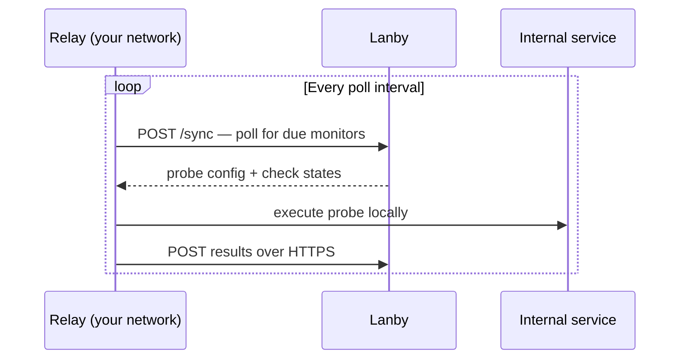

# Relay agents

A relay is a lightweight agent you run inside your own network. It polls Lanby for assigned monitors and executes probes locally — letting you monitor services that are never exposed to the internet, without opening any inbound firewall ports.

## Why relays exist

Lanby's platform-managed probes run from the internet. That works great for public services, but breaks down the moment you want to check anything on a private network — a NAS, a home automation server, an internal database, or a service behind a VPN.

The naive solution — punch a hole in your firewall and let Lanby reach in — trades monitoring convenience for a permanent inbound exposure. A relay takes the opposite approach: the agent reaches *out* to Lanby. Your firewall stays exactly as it is.

## How it works

The relay agent runs as a Docker container on any machine inside your network. It maintains a persistent outbound connection to Lanby and polls for its assigned monitors. When a probe is due, the relay executes it locally and reports the result back.



A periodic heartbeat also lets Lanby report relay health independently of probe results.

## Security model

The relay is designed so that deploying it does not increase your network's attack surface.

**No inbound ports, ever.**
The relay does not listen on any port and does not run a web server. There is nothing reachable from outside your network — not from Lanby, not from anyone else. Your firewall rules do not change.

**Outbound HTTPS only.**
All communication is initiated by the relay over port 443 using TLS. It's the same traffic profile as a browser or a package manager update.

**Probe results only, never payload data.**
The relay sends *outcomes* back to Lanby: pass/fail, latency, status code, and any error message. Response bodies and internal data stay inside your network.

**No special privileges required.**
The relay container runs as an unprivileged process. No `--privileged` flag, no host networking, no kernel capabilities beyond what a normal container has.

**Claim codes are one-time and account-scoped.**
A relay can only be claimed by someone logged in to your Lanby account who holds the code. The code is single-use and only printed to local logs — it cannot be discovered remotely.

!!! info
    The relay only needs outbound HTTPS (port 443) to reach Lanby, plus access to whichever internal hosts and ports you want it to probe. It does not need internet access for anything else.

## Probe allowlist

By default, the relay probes any target Lanby assigns to it. If you want an extra layer of local control — for example, to prevent the relay from contacting hosts outside your LAN even if your account were compromised — set `ALLOWED_PROBE_HOSTS`.

When set, the relay only executes probes whose target matches at least one entry. Targets that don't match are skipped and logged as a warning. The relay refuses to start if any entry is malformed.

### Pattern syntax

The value is a comma-separated list. Three forms are supported:

| Pattern | Example | Matches |
|---|---|---|
| Exact hostname or IP | `mynas.local` | `mynas.local` only |
| Wildcard subdomain | `*.home.arpa` | `foo.home.arpa`, not `home.arpa` itself |
| CIDR block | `192.168.0.0/16` | IP-literal targets in that range |

```yaml
environment:
  ALLOWED_PROBE_HOSTS: "*.local,*.home.arpa,192.168.0.0/16,10.0.0.0/8"
```

!!! tip
    CIDRs match only IP-literal targets. For hostname-based targets like `mynas.local`, use a hostname pattern (`mynas.local` or `*.local`) — the relay checks the raw target string, not its resolved IP.

## The claim flow

When a relay starts for the first time it prints a short **claim code** to its logs. Paste that code into the Lanby console to associate the relay with your account. After claiming, the relay is ready to be assigned monitors.

1. Relay starts → generates identity → prints claim code to stdout
2. Copy the code from `docker logs lanby-relay`
3. Go to **console → Relays → Claim**, paste the code, click **Claim relay**
4. Relay appears in the console → assign monitors → probes start immediately

!!! tip
    The claim code is only printed on **first startup**. If you miss it, delete the identity volume (`lanby-relay-data`) and restart the container to generate a new one. The relay will need to be re-claimed.

## Deploying a relay

### 1. Start the container

```sh
docker run -d \
  --name lanby-relay \
  --restart unless-stopped \
  -v lanby-relay-data:/data \
  -e IDENTITY_PATH=/data/identity.json \
  ghcr.io/lanby-dev/lanby-relay:latest
```

Or with Docker Compose:

```yaml
services:
  lanby-relay:
    image: ghcr.io/lanby-dev/lanby-relay:latest
    restart: unless-stopped
    environment:
      IDENTITY_PATH: /data/identity.json
      # Optional: restrict which hosts this relay may probe
      # ALLOWED_PROBE_HOSTS: "*.local,192.168.0.0/16"
    volumes:
      - relay-data:/data

volumes:
  relay-data:
```

### 2. Get the claim code

```sh
docker logs lanby-relay 2>&1 | grep "claim code"
# {"level":"INFO","msg":"relay waiting to be claimed","claim_code":"ABCD-1234", ...}
```

### 3. Claim in the console

Go to [console.lanby.dev/relays](https://console.lanby.dev/relays), paste the claim code, and click **Claim relay**. The relay appears in the table within a few seconds.

### 4. Assign monitors

When creating or editing a monitor, select your relay from the **Relay** dropdown. The relay begins probing on its next poll cycle.

## Identity and restarts

The relay generates a **persistent identity file** on first startup and saves it to the mounted volume. On every subsequent start it loads the same identity — so the relay reconnects to your account automatically without needing to be re-claimed.

If you delete the identity volume or move the relay to a new machine without copying the identity file, it will generate a new identity and you'll need to claim it again. The old relay entry in the console can then be deleted.

## Configuration

All configuration is via environment variables.

| Variable | Default | Description |
|---|---|---|
| `PLATFORM_URL` | `https://api.lanby.dev` | Lanby API base URL |
| `IDENTITY_PATH` | `./identity.json` | Path to persist relay identity |
| `AGENT_VERSION` | *(build-time)* | Version string reported to the platform |
| `CONFIG_POLL_SECONDS` | `15` | Base poll interval in seconds |
| `ALLOWED_PROBE_HOSTS` | *(unset — all hosts permitted)* | Comma-separated probe target allowlist |

## Requirements

- Docker (any recent version)
- Outbound HTTPS access to Lanby (port 443)
- Network access to the services you want to probe
- A persistent volume for the identity file

The relay has no inbound port requirements and does not run any web server.
